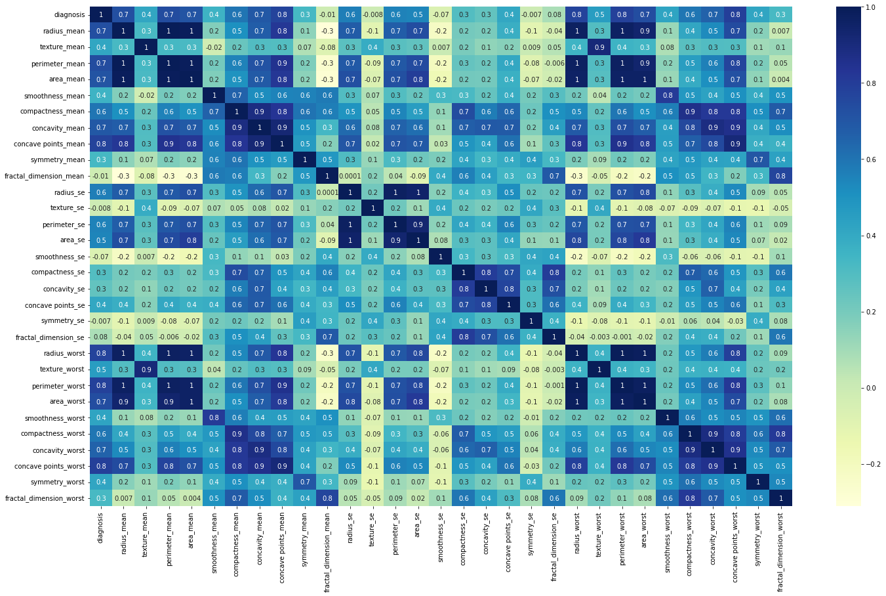
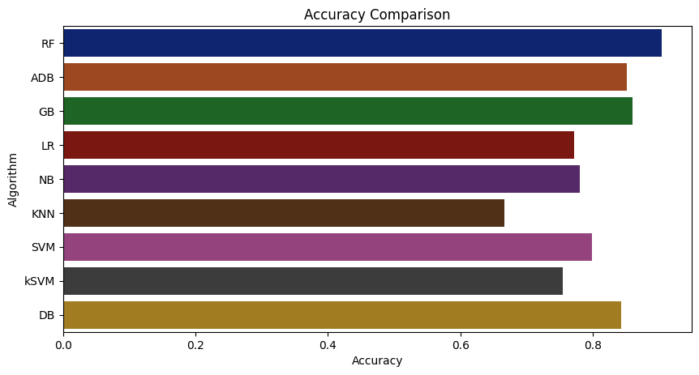
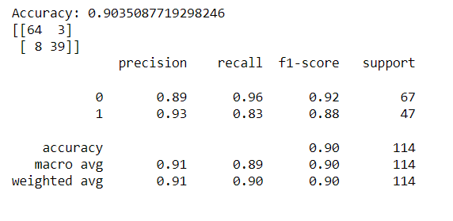

# Breast-Cancer-Prediction
The goal of this project is predict Breast Cancer by using parameters such as Texture Mean, Smoothness Mean, Compactness Mean
, Symmetry Mean, Fractal Dimension Mean, Texture SE, Smoothness SE, Symmetry SE, Symmetry Worst etc.

## Description
## Domain : Healthcare
## Technology:- Machine Learning and Web Development
## Languages:- python, html, css and javascript
## Framework:- Flask 
## Libraries used:-
1. Numpy
2. Matplotlib
3. Seaborn
4. Sklearn
5. Pandas
## 1. Dataset:- Breast_data.csv
This is open source data set taken from kaggle.  
Attribute Information:

1) ID number 2) Diagnosis (M = malignant, B = benign)

Ten real-valued features are computed for each cell nucleus:

a) radius (mean of distances from center to points on the perimeter) b) texture (standard deviation of gray-scale values) c) perimeter d) area e) smoothness (local variation in radius lengths) f) compactness (perimeter^2 / area - 1.0) g) concavity (severity of concave portions of the contour) h) concave points (number of concave portions of the contour) i) symmetry j) fractal dimension ("coastline approximation" - 1)

The mean, standard error and "worst" or largest (mean of the three largest values) of these features were computed for each image, resulting in 30 features. For instance, field 3 is Mean Radius, field 13 is Radius SE, field 23 is Worst Radius.

All feature values are recoded with four significant digits.

Missing attribute values: none

Class distribution: 357 benign, 212 malignant

Here 'id' and 'Unnamed: 32' feature has no value in given dataset. So we drop that both features.

## 2. Data Cleaning
Steps followed during data cleaning:-
1. Replace categorical values into numerical values.

2. Drop the null values.
## 3. Exploratory Data Analysis
Steps followed in EDA:-
1. Find out correlation in data set

2. Remove correlated features

## 4. Spilt the 80 % data for training and 20% data for testing
 

## 5. Creation of machine learning model

## Machine Learning models are created by following Algorithms
1. Random Forest Algorithm
2. AdaBoostClassifier
3. GradientBoosting
4. Logistic Regression
5. Naive Bayes
6. KNN
7. Kernal SVM
8. Decision Tree

We have taken the Random forest algorithm model because of it's accuracy.

## 6. Hyperparameter tunning
Perform the hyperparameter tuning to avoid the overfitting in model.
### We got 90.35% accuracy 

## 7. Deploy model on website
Create website using flask and use model for prediction.

